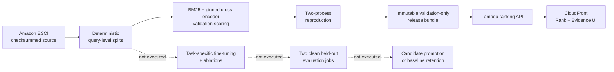

# Machine Learning Product Search Ranking Platform

[](https://github.com/ArmanM1/machine-learning-product-search-ranking-platform/actions/workflows/pull-request.yml)
[](LICENSE)
[](pyproject.toml)
[](web/package.json)

A production-minded product-search reranker that scores a supplied candidate set with a pinned cross-encoder, compares the result with BM25, and exposes the ranking and its evidence through a small AWS application.

The current portfolio release is deliberately scoped to the strongest unchanged model: `cross-encoder/ms-marco-MiniLM-L6-v2` over enriched product text. It is a reproducible **validation-only baseline**, not a claim of project-specific fine-tuning or held-out test performance.

> **Public demo:** final CloudFront activation and independent browser verification are in progress. The generated URL will be placed here only after that verification succeeds.


> This repository image is still the explicitly labeled fixture capture. It will be replaced by a live-release capture with the final deployment evidence; its illustrative values are not portfolio claims.

## Measured result

The pinned cross-encoder was evaluated twice in separate scoring processes on the same 2,057-query validation split. Both processes reproduced every quality metric, rank, and score exactly. The official test split was not accessed.

| Validation metric | Pinned cross-encoder | Enriched-text BM25 | Difference |
|---|---:|---:|---:|
| Project-defined graded nDCG@10 | 0.849037 | 0.821627 | +0.027410 |
| Exact MRR@10 | 0.819114 | 0.741932 | +0.077182 |
| Exact top-1 rate | 0.721439 | 0.610112 | +0.111327 |

These are descriptive validation comparisons between unchanged systems. They are not held-out estimates, confidence-bounded improvements, or evidence that the project trained a better model. The full sanitized result is committed in [`evidence/baselines/milestone-2-validation.json`](evidence/baselines/milestone-2-validation.json).

## What this demonstrates

- **Ranking quality:** BM25 and a compact cross-encoder score identical candidate groups, with deterministic query-level metrics and ranking artifacts.
- **Reproducibility:** content-addressed data, exact model revision and configuration, two independent validation scoring processes, and checksum-bound release evidence.
- **Production engineering:** a containerized FastAPI service on Lambda, CloudFront delivery, a restrained React Rank/Evidence interface, Terraform, protected GitHub Actions, and fail-closed activation.
- **Honest evidence boundaries:** validation is clearly separated from held-out evaluation; cold and warm serving measurements are separated; unexecuted fine-tuning and rollback paths are not presented as completed work.
- **Software quality:** typed Python and TypeScript, contract and integration tests, dependency and infrastructure scans, least-privilege GitHub OIDC roles, and deployment smoke tests.

## Executed system flow



The solid path is the current portfolio release. The dashed path is implemented as a guarded experiment/release contract but has not been executed. The service reranks a known list of candidates; it is not a full-catalog retrieval engine or marketplace.

## Stack

| Layer | Technologies |
|---|---|
| Ranking | PyTorch, Transformers, sentence-transformers, BM25, scikit-learn |
| Data and evidence | pandas, PyArrow, Pydantic, NumPy/SciPy, immutable JSON/Parquet artifacts |
| API and UI | FastAPI, AWS Lambda container images and Function URLs, React, TypeScript, Vite |
| Cloud | S3, ECR, Lambda, CloudFront, CloudWatch; guarded SageMaker Training/Processing path |
| Delivery | Terraform, GitHub Actions OIDC, pytest, Vitest, Playwright, Ruff, mypy, Trivy, Checkov |

## Public API

The same-origin demo exposes a small, evidence-first contract:

| Route | Purpose |
|---|---|
| `GET /healthz` | Process health |
| `GET /readyz` | Loaded model and release readiness |
| `GET /api/v1/models` | Active model and comparison systems |
| `GET /api/v1/queries` | Curated public query set |
| `POST /api/v1/rank` | Rerank a supplied candidate list |
| `GET /api/v1/comparisons/{query_id}` | Side-by-side ranking movement |
| `GET /api/v1/runs/{run_id}` | Sanitized quality, provenance, and limitation evidence |
| `GET /api/v1/operations` | Version-bound warm serving measurements and cold-start disclosure |

The running service publishes its typed OpenAPI contract at `/openapi.json`; the source models and error semantics live in [`src/search_rank/schemas/api.py`](src/search_rank/schemas/api.py).

## Run locally

Prerequisites: Python 3.11, Node.js, npm, and [uv](https://docs.astral.sh/uv/).

```powershell
uv sync --frozen --extra dev
uv run pytest

npm --prefix web ci
npm --prefix web run lint
npm --prefix web test
npm --prefix web run dev
```

Open `http://localhost:4173`. The default frontend mode uses explicit fixtures, labels every value as illustrative, and never presents them as measured results. A deployment sets `VITE_DATA_MODE=api` to bind the interface to a published release.

## Reproduce the evidence path

```powershell
uv run search-rank --help
uv run python -m search_rank.cli baseline run --config configs/experiments/baselines-v1.yaml
uv run pytest tests/unit tests/contract tests/integration
```

Cloud writes are restricted to protected GitHub environments on `main`; see [cloud deployment](docs/cloud-deployment.md) for the workflow inputs and artifact handoffs.

## Engineering notes

- [Architecture](docs/architecture.md)
- [Data card](docs/data-card.md)
- [Model card](docs/model-card.md)
- [Evaluation protocol](docs/evaluation-methodology.md)
- [Reproducibility](docs/reproducibility.md)
- [Security model](docs/security.md)
- [Failure analysis](docs/failure-analysis.md)
- [Requirements traceability](docs/requirements-traceability.md)

## Current evidence boundary

The prepared dataset, baseline scoring, two-process quality/ranking reproduction, and immutable validation-only release bundle are complete. Final public activation is still pending, so no public URL or successful production-deployment claim appears in this commit. Project-specific training, held-out evaluation, candidate promotion, rollback proof, and teardown proof remain unexecuted. The machine-readable boundary is [`evidence/status.json`](evidence/status.json).

## License and data

Project code is released under the [MIT License](LICENSE). The Amazon Shopping Queries ESCI source dataset has its own Apache-2.0 licensing and attribution requirements; raw data and model weights are not committed to this repository. See the [license review](docs/license-review.md) and [data card](docs/data-card.md).
