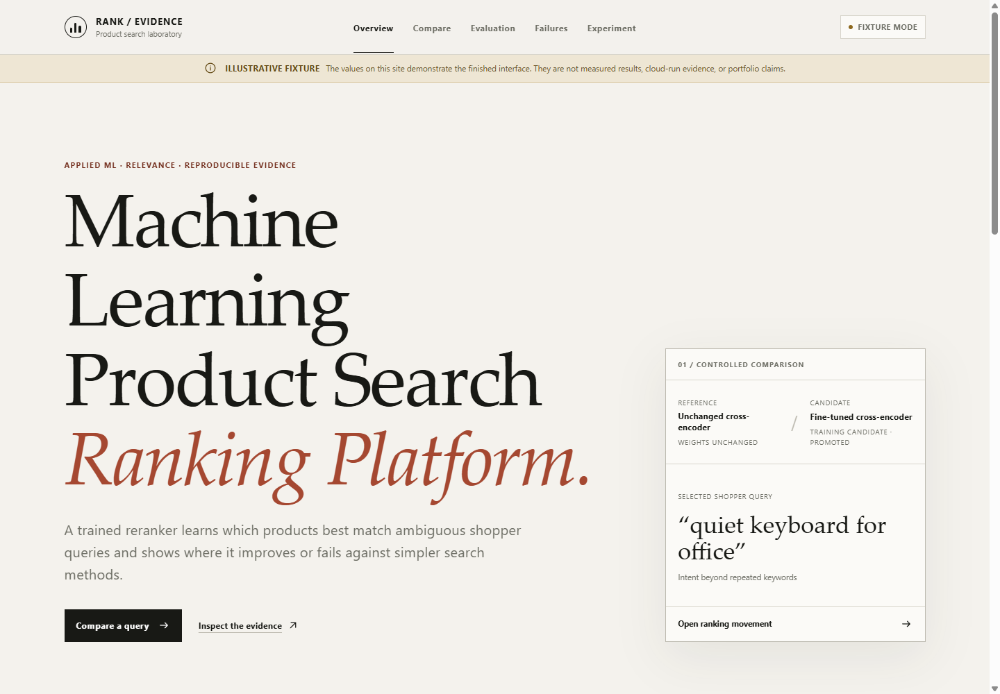
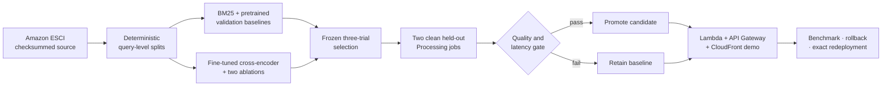

# Machine Learning Product Search Ranking Platform

[](https://github.com/ArmanM1/machine-learning-product-search-ranking-platform/actions/workflows/pull-request.yml)
[](LICENSE)
[](pyproject.toml)
[](web/package.json)

An end-to-end applied-ML system for reranking supplied product candidates for ambiguous shopping queries. It turns Amazon Shopping Queries ESCI data into reproducible baselines, a fine-tuned cross-encoder, paired evaluation evidence, and a public serverless comparison experience.

The project is deliberately more than a notebook: immutable artifacts, held-out access controls, ablations, promotion gates, rollback, infrastructure as code, and a recruiter-friendly evidence UI are part of the same versioned release path.



> UI preview captured from the repository's clearly labeled fixture mode. The final evidence commit replaces illustrative values with verified release artifacts and publishes the live CloudFront URL.

## What this demonstrates

- **Learning to rank:** BM25 and an unchanged pretrained cross-encoder are compared with a task-fine-tuned cross-encoder on identical candidate groups.
- **Credible evaluation:** query-level graded nDCG, paired bootstrap confidence intervals, deterministic ranking artifacts, latency distributions, slices, wins, losses, and two controlled ablations.
- **Leakage-resistant release engineering:** validation selects the model; the official test split is available only to two separately counted clean release jobs after trial selection is frozen.
- **Production ML operations:** content-addressed data, digest-pinned containers, SageMaker Managed Spot training, immutable S3 evidence, promotion/retention decisions, Lambda aliases, CloudFront, rollback, and automatic public-serving expiry.
- **Software quality:** typed Python and TypeScript, contract and integration tests, container/IaC/dependency scans, least-privilege GitHub OIDC roles, and Terraform drift checks.

## System flow



The serving surface reranks a known list of candidates; it is not a full-catalog retrieval engine or marketplace.

## Stack

| Layer | Technologies |
|---|---|
| Ranking | PyTorch, Transformers, sentence-transformers, BM25, scikit-learn |
| Data and evidence | pandas, PyArrow, Pydantic, NumPy/SciPy, immutable JSON/Parquet artifacts |
| API and UI | FastAPI, AWS Lambda container images, API Gateway, React, TypeScript, Vite |
| Cloud | SageMaker Training/Processing, S3, ECR, CloudFront, EventBridge, CloudWatch |
| Delivery | Terraform, GitHub Actions OIDC, pytest, Vitest, Playwright, Ruff, mypy, Trivy, Checkov |

## Public API

The same-origin demo exposes a small, evidence-first contract:

| Route | Purpose |
|---|---|
| `GET /healthz` | Process health |
| `GET /readyz` | Loaded model and release readiness |
| `GET /api/v1/models` | Active model and comparison systems |
| `GET /api/v1/queries` | Curated public query set |
| `POST /api/v1/rank` | Rerank a supplied candidate list |
| `GET /api/v1/comparisons/{query_id}` | Side-by-side ranking movement |
| `GET /api/v1/runs/{run_id}` | Sanitized quality, interval, provenance, and limitation evidence |
| `GET /api/v1/operations` | Version-bound warm serving measurements and cold-start disclosure |

The running service publishes its typed OpenAPI contract at `/openapi.json`; the source
models and error semantics live in [`src/search_rank/schemas/api.py`](src/search_rank/schemas/api.py).

## Run the local preview

Prerequisites: Python 3.11, Node.js, npm, and [uv](https://docs.astral.sh/uv/).

```powershell
uv sync --frozen --extra dev
uv run pytest

npm --prefix web ci
npm --prefix web run lint
npm --prefix web test
npm --prefix web run dev
```

Open `http://localhost:4173`. The default frontend mode uses explicit fixtures, labels every value as illustrative, and never presents them as measured results. Set the deployment-time `VITE_DATA_MODE=api` configuration to bind the UI to a verified public release.

## Reproduce the evidence path

```powershell
uv run search-rank --help
uv run python scripts/validate_training_contracts.py config --config configs/experiments/candidate-v1.yaml --instance-type ml.g4dn.xlarge --accelerator gpu
uv run pytest tests/unit tests/contract tests/integration
```

Cloud writes are intentionally restricted to protected GitHub environments on `main`; see [cloud deployment](docs/cloud-deployment.md) for the exact workflow inputs and artifact handoffs.

## Engineering notes

- [Architecture](docs/architecture.md)
- [Data card](docs/data-card.md)
- [Model card](docs/model-card.md)
- [Evaluation protocol](docs/evaluation-methodology.md)
- [Reproducibility](docs/reproducibility.md)
- [Security model](docs/security.md)
- [Failure analysis](docs/failure-analysis.md)
- [Requirements traceability](docs/requirements-traceability.md)

## Current evidence boundary

The AWS platform and content-addressed prepared dataset are live. Result-bearing claims—held-out quality, latency, selected model, public URL, and rollback proof—are published only after their automated gates complete. Machine-readable status lives in [`evidence/status.json`](evidence/status.json); fixture values in the screenshot are not portfolio claims.

## License and data

Project code is released under the [MIT License](LICENSE). The Amazon Shopping Queries ESCI source dataset has its own Apache-2.0 licensing and attribution requirements; raw data and trained artifacts are not committed to this repository. See the [license review](docs/license-review.md) and [data card](docs/data-card.md).
